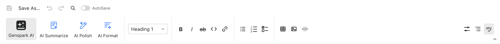

# The Markdown editor

The Markdown editor opens .md / .markdown with a source + rendered-preview experience.

- **Open**: from Home or File ▸ Open; the CLI works too.
- **Edit**: plain-text editing; GFM extensions (tables, task lists, strikethrough, autolinks) render in the preview.
- **Preview**: live; relative assets like images resolve next to the document.
- **Saving**: byte-faithful — BOM, CRLF and the presence of a trailing newline are preserved; an unmodified save does not rewrite the file.
- **Find & replace**: ctrl+F searches the source; Replace All writes back.
- **AI**: preset buttons let the assistant rewrite, extend or translate the document.

## The toolbar

One row of buttons above the editor (hover for tooltips):

- **File & history**: Save, Save As, Undo, Redo, Find; the **AutoSave** toggle on the right writes changes to disk on a timer.
- **AI button**: opens the AI panel; next to it are the rewrite / extend / translate presets.
- **Paragraph style** (dropdown): switch between body text and heading levels.
- **Inline formatting**: **bold**, _italic_, ~~strikethrough~~, `inline code`, link.
- **Lists**: bullet, numbered, task list.
- **Insert**: table, image, horizontal rule.
- **Properties**: insert or jump to the YAML front matter block at the top of the file.
- **Outline**: jump by heading hierarchy.
- **Spellcheck**: toggle spellcheck for this document.

Three quick examples:

- **Heading**: put the cursor on the line ▸ paragraph-style dropdown ▸ "Heading 1".
- **Table**: click **Insert table** ▸ drag the row/column count ▸ type into the cells; the preview renders it immediately.
- **Task list**: select a few lines ▸ click **Task list** ▸ each line becomes `- [ ]`, rendered as checkboxes in the preview.
