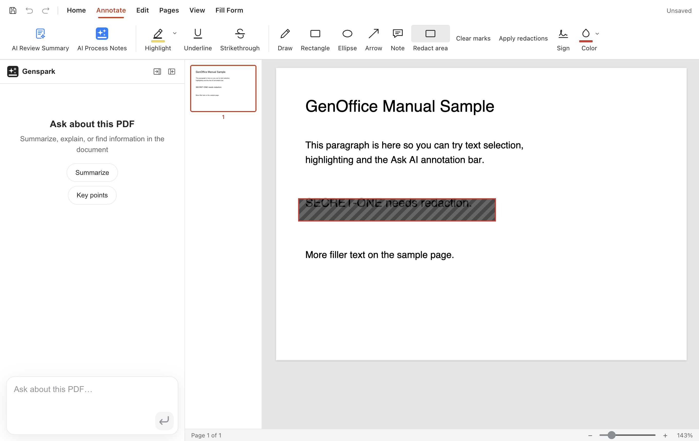

# PDF: reading, annotating and redacting

The PDF editor has five ribbon tabs: **Home / Annotate / Edit / Page / View**. It reads and writes: text is editable, content can be redacted, signed, and forms can be filled.

## Reading and navigation

- Left sidebar: **thumbnails** (click to jump, visible range highlighted) or **outline** (bookmarks, when present).
- Zoom: the ratio control bottom-right; ctrl+wheel steps the zoom.
- Rotation: per-page or all pages from the Page menu; rotations are written back on save.
- Search: ctrl+F full-text with all hits highlighted.
- Encrypted PDFs: a password prompt (its own small window) opens them; the password is used for this session only.

## Text selection and markup (Annotate)

Try it on any paragraph:

1. **Drag the mouse across a sentence** — on release, an annotation bar floats above it:

2. Pick **highlight** (the yellow swatch opens a color palette), **underline** or **strikethrough**; **Ask AI** sends the selection with your question to the AI panel.
3. To undo an annotation, drag-select the same passage again and click the active button on the bar (a Word-style toggle), or select it and press Delete.

Reference:

- Drag over text and a popup bar appears: **highlight / underline / strikethrough / copy / Ask AI**.
- Colors come from the palette; **applying the same markup to an already-marked range removes it** (Word-style toggle).
- Markups already saved into the file can be selected and deleted (⋯ menu or Delete).
- **Note**: while a drawing tool is armed the text layer is not selectable — the tool disarms itself after each placement, so you are back in select mode for the next action.

## Drawing tools (Annotate)

Six tools: **ink, rectangle, ellipse, arrow, note**, plus the **redaction box** on the Edit tab.

- Each tool is a toggle: click to arm; **it disarms itself once a shape lands** (click the tool again to keep going); clicking the armed tool also disarms.
- Ink follows the stroke width; rectangle/ellipse/arrow are dragged out; colors come from the drawing palette.
- Placed shapes can be selected, deleted, dragged, and (rect/ellipse) resized.
- **Redaction, the full workflow** (hiding a line of text):

  1. Annotate tab ▸ click **Redact area** (the tool arms).
  2. **Drag a box over the content** — it gets covered by a hatched mark, and the toolbar gains **clear-marks / apply-redaction** buttons:

  

  3. Click **Apply redaction** and confirm — the result is a working copy where the covered text and images are physically removed (not covered) and it cannot be undone; the original document stays untouched.

  Made a mistake? The clear-marks button wipes the current marks so you can redraw.

## Sticky notes and comment threads

- The **note tool** drops a pin and opens a margin card for the text (author name configurable); confirming saves it as a standard PDF Text annotation.
- Click a pin to open the thread: **reply** (flat WPS/Acrobat-style threads), **edit** your comment, **delete** one comment or a whole thread.
- Edits in flight survive until the save writes the new text back into the same annotation in the file, keeping reply chains intact.

## Editing PDF content (Edit)

- **Edit text**: click text to edit it block by block (pdfium engine; fonts matched best-effort).
- **Insert text**: place searchable text with font/size/color of your choice.
- **Insert image / stamp**.
- Forms: AcroForm fields fill directly; values are written on save.

## Signatures

- **Ink signature**: draw it; it can attach to a form signature field.
- **Image signature**: place a picture as the signature.
- Saved signatures can be reused.

## Page operations (Page)

- **Rotate / delete / reorder**: drag thumbnails to reorder; deletion confirms.
- **Extract pages**: export selected pages into a new PDF.
- **Split**: by ranges into several files.
- **Merge**: append other PDFs. Sizes are summed **before** anything is read and anything over **1 GiB total is refused** with a readable error (keeps memory bounded).
- Page-level changes write back on the next save; Save As leaves the original untouched.

## Export and print

- **Convert to Word**: local conversion to .docx.
- **Print**: current order and rotations through the system dialog; page ranges supported.

## Saving

- Regular Save/autosave writes annotations and edits back into the file (atomic).
- **Redaction goes through its Apply flow** producing a copy, leaving the original untouched so sensitive content does not linger in it.
