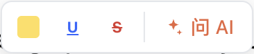
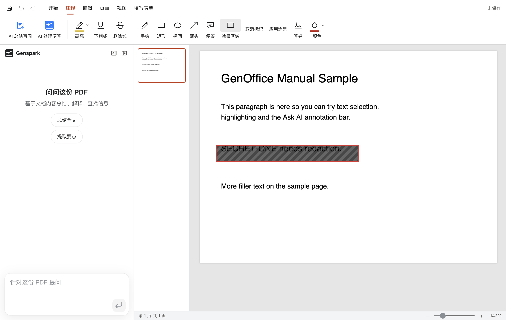

# PDF：阅读、注释与涂黑

PDF 编辑器有五个功能区标签：**开始 / 注释 / 编辑 / 页面 / 视图**。它既能读也能改：文字可以编辑、可以涂黑（redact）、可以签名、可以填表单。

## 阅读与导航

- 左侧栏：**缩略图**（点击跳页、显示当前可见范围）或**大纲**（书签目录，有则显示）。
- 缩放：右下角比例控件，ctrl+滚轮逐档缩放。
- 页面旋转：页面菜单里逐页/全部旋转，旋转在保存时写回文件。
- 搜索：ctrl+F 全文查找，高亮所有命中。
- 加密 PDF：打开时弹出密码框（独立小窗），只在本会话使用。

## 文字选择与标注（注释 ▸ 高亮家族）

试一下（对着任意一段文字）：

1. 在正文上**按住鼠标拖过一句话**——松开后文字上方浮出标注条：

2. 点标注条上的 **高亮**（黄色方块=色板，可选颜色）、**下划线** 或 **删除线**；点 **问 AI** 则把选中文字连同问题发给 AI 面板。
3. 想撤销某条标注：再对同一段文字拖选一次，点弹条上对应的已生效按钮即可取消（Word 式开关）；或选中后按 Delete。

其他要点：

- 已保存进文件的标注同样可选中外删（⋯ 菜单或 Delete）。
- **注意**：绘图工具（见下）处于激活状态时文字层不可选——放置完一个图形后工具自动解除，回到选择模式即可继续选字。
- 标注颜色可在色板里选；**再次对同一段落点同一个标注 = 取消**（Word 式开关）。
- 已保存进文件的标注同样可选中外删（⋯ 菜单或 Delete）。
- **注意**：绘图工具（见下）处于激活状态时文字层不可选——放置完一个图形后工具自动解除，回到选择模式即可继续选字。

## 绘图工具（注释 ▸ 绘图）

六个工具：**墨迹（手绘）、矩形、椭圆、箭头、便签**，以及编辑页签里的**涂黑框**。

- 每个工具是开关按钮：点一下激活，**放置完一个图形自动解除**（想连续画就再点一次工具）；再点激活中的工具也是解除。
- 墨迹按笔宽绘制；矩形/椭圆/箭头拖拽画出；颜色用绘图色板。
- 画好的图形可以：选中后删除、拖动移动、（矩形/椭圆）拉伸调整大小。
- **涂黑（redact）完整流程**（以藏住一行文字为例）：

  1. 注释页签 ▸ 点 **涂黑区域**（工具变为激活态）。
  2. 在要藏住的内容上**拖出一个框**——框内文字被斜纹标记盖住，工具栏同时出现 **取消标记 / 应用涂黑** 两个按钮：

  

  3. 点 **应用涂黑**，确认后 GenOffice 另存一份工作副本并打开它——被涂区域的文字与图像从文件里**物理删除**（不是盖黑块），无法恢复；原文档保持不动。

  画错了就用 **取消标记**（清除当前所有标记）再重画。

## 便签与评论线程

- **便签工具**：点页面放置一枚图钉，在页边卡片里输入内容（作者名可设置），确认后保存为标准 PDF 文本注释。
- 点图钉展开线程：可**回复**（WPS/Acrobat 式扁平线程）、**编辑**自己的评论、**删除**整条或整个线程。
- 编辑中的评论在自动保存前会保留；保存把新文字写回文件里同一条注释（保留回复关系）。

## 编辑 PDF 内容（编辑页签）

- **编辑文字**：点文字进入编辑，逐块修改（引擎为 pdfium，复杂字体尽力匹配）。
- **插入文字**：在指定位置插入可搜索的文字（选择字体、大小、颜色）。
- **插入图片 / 图章**：放置图片或盖章。
- 表单：AcroForm 字段可直接填写；填写结果随保存写入。

## 签名

- **墨迹签名**：手绘签名，可关联到表单签名字段。
- **图片签名**：用一张图片作为签名放置。
- 签名保存后可重复使用。

## 页面操作（页面页签）

- **旋转 / 删除 / 重排**：缩略图栏拖拽重排；删除有确认。
- **提取页面**：把选中页导出成新 PDF。
- **拆分**：按范围拆成多份。
- **合并**：追加其他 PDF。合并前会先统计所有文件的总大小，**超过 1 GiB 拒绝**并提示（防止一次性把内存吃光）。
- 页面级的修改在下次保存写回文件；工作副本另存不覆盖原件。

## 导出与打印

- **导出为 Word**：本地转换为 .docx。
- **打印**：按当前顺序与旋转走系统打印；可选页范围。

## 保存

- 普通 保存/自动保存 把注释与编辑写回原文件（原子写）。
- **涂黑走「应用」流程**生成副本，原文档不动，避免把敏感内容留在原文件里。
