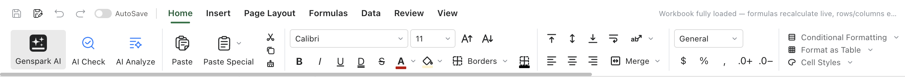

# Sheets: spreadsheets

Sheets is the Excel-like editor; calculation runs in a separate Rust engine process (a crash there never takes the app down). Opens and saves genuine .xlsx; .csv and .tsv open as tables.

## The interface

- **Ribbon**: eight tabs, listed one by one below.
- **Formula bar**: shows and edits the active cell's formula; common functions supported.
- **Sheet tabs** (bottom): add / rename / delete / move sheets.
- **Cell editing**: double-click or just type; Enter confirms and moves down, Tab moves right, Escape cancels (Excel habits).
- **Shortcuts**: aligned with the Excel family (ctrl+C/V/X, ctrl+Z/Y, ctrl+F, ...).

## Ribbon tabs

- **Home**: font, fill, borders, number formats (currency/percent/thousands, decimal up/down), alignment, merge, row/column insert and size, conditional formatting, format-as-table, cell styles, clipboard & format painter, sort & filter.
- **Insert**: shapes, icons, symbols, equation, screenshot and more.
- **Page Layout**: theme colors & fonts, print gridlines/headings toggles, page-break preview.
- **Formulas**: AutoSum and function insert, define names (also from selection), trace precedents/dependents, the Watch Window, recalculate sheet/workbook.
- **Data**: sort & filter (incl. advanced filter, clear filter), text-to-columns, merge workbooks, refresh all.
- **Review**: browse comments (show, previous/next), translate.
- **View**: gridlines & headings toggles, zoom, Normal / page-break preview.
- **Chart Design**: appears with a chart selected — chart type, styles and colors, edit the data range.

The Data and Formulas tabs in place:




## Numbers and formatting

- Number formats: general, number, currency, percent, date/time, fraction, scientific and more.
- Alignment, wrap, merged cells, borders and fills.
- Row heights and column widths by dragging; double-click a boundary to auto-fit.

## Data

**Sort & filter** (descending by one column, for example):

1. Click **any cell in that column** (no need to select the whole column).
2. Home tab ▸ **Sort & Filter** ▸ **Descending**; whole rows reorder together (the area sorts as one).
3. For custom rules (multiple columns, by color): the same path, **Custom Sort**.
4. Filter: select the header row and click **Sort & Filter ▸ Filter** — each header gets a ▼ dropdown where you check the values to keep; clear the filter to bring everything back.

- Sort and filter.
- Frozen panes.
- .csv / .tsv: open directly as a table (tab-delimited tsv parsed as one); saving writes the original format back.

## The script editor (advanced)

Sheets ships a **script editor** with a Google-Apps-Script-shaped API for bulk work.

- Open: Tools ▸ Script editor (or the developer menu, per version).
- UI: script library on the left (new/delete), code editor + output pane on the right; **Run / Stop** buttons.
- The API is async:

```js
const sheet = await SpreadsheetApp.getActiveSpreadsheet()
const active = await sheet.getActiveSheet()
const range = await active.getRange('A1:C10')
const values = await range.getValues() // 2D array
await range.setValues(values.map((row) => row.map((v) => v * 2)))
Logger.log('done')
```

- `SpreadsheetApp` (entry), `Sheet` (getName/getRange/getLastRow...), `Range` (getValue(s)/setValue(s)/clear...), `Logger.log`, `Utilities.sleep`.
- Scripts run in a **sandboxed worker**: no network, no file system, no DOM — the API above is all they can touch, so a buggy or hostile script cannot reach anything else.
- The output pane caps its line count so huge logs cannot wedge the UI.
- **The AI can run scripts too**: the assistant's `run_script` tool executes the same sandboxed API — ideal for bulk, rule-based transforms.

## AI

- The side AI panel: select a range and instruct in plain language (reformat, generate data, write formulas).
- AI edits can be rolled back from the panel.

## Saving and export

- Saves .xlsx (formulas and formats preserved); Save As; Export to PDF follows print pagination.
- Autosave follows the global rule (on after the first manual save).

## Stability

- The Rust calculation sidecar is process-isolated from the UI: if extreme data kills it, you get a message and a session recovery attempt — not an app crash.
