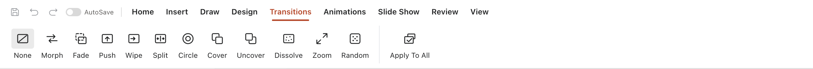

# Slides: presentations

Slides is the PowerPoint-like editor: reads and writes genuine .pptx.

## The interface

- **Ribbon**: the Home tab carries insert & format (text box/shape/picture/table/chart), font & paragraph, align & arrange (z-order, align, distribute).
- **Thumbnail rail** (left): click to switch, drag to reorder, context menu for new/duplicate/delete.
- **Canvas**: WYSIWYG editing; drag, scale handles, guides.
- **Notes**: per-slide speaker notes, kept in export flows.

## Ribbon tabs

The tab strip (macOS starts at Home; Windows adds a File tab):

- **Home**: insert & format — text box, shapes, pictures, tables, charts; font & paragraph; align & arrange (z-order/align/distribute); layout.
- **Insert**: text box, table (rows/columns selectable), pictures, page number, a jump button (click it while presenting to jump to a slide) and more.
- **Draw**: the **pen** (hand-draw on the slide, saved as ink on the page) and the **highlighter** (translucent, thicker strokes), with pen width; click the tool again to cancel.
- **Design**: themes, color scheme and background; masters and layouts.
- **Transitions**: pick a transition for the current slide (in effect in PowerPoint's presenter), with apply-to-all; None removes it.

  

- **Animations**: entrance/emphasis effects for the selected shape, **motion paths** (move along a path); **preview** plays the slide's animations on the canvas; None removes them.

  

  Try it: select the title text box ▸ Animations tab ▸ pick an entrance effect ▸ **Preview** plays it on the canvas.

- **Slide Show**: present from the start or the current slide, plus show settings.
- **Review**: **new comment** on the current slide (written into the pptx, visible in PowerPoint).
- **View**: **Normal** (thumbnails + canvas), **Outline** (browse and jump by text), **Slide Sorter** (grid overview, double-click to edit), **Reading** (full-screen, page by page; Esc exits).

## Content

- Text boxes, shapes (fill/stroke/shadow), pictures (crop/replace), tables, charts (column/bar/line/pie..., editable data).
- Masters and layouts: unify fonts, placeholders and backgrounds; new slides inherit the chosen layout.
- Theme colors and fonts follow the theme.

## AI generation

- Home's AI Slides card: give a topic or outline and the AI builds the deck; cloud generation falls back to local generation on failure.
- Keep adjusting with the AI panel afterwards (the AI restyles through a controlled script sandbox — the same sandbox mechanism as in [Sheets](help://sheets)).

## Present and export

- **Export to PDF**: page-by-page rasterization in a hidden window, with progress and a timeout watchdog for big decks.
- Image export: PNG per page.
- Full-screen presenting where the version provides it.

## Saving

Full .pptx round-trip: untouched pages stay byte-identical; notes, masters and annotations persist.
